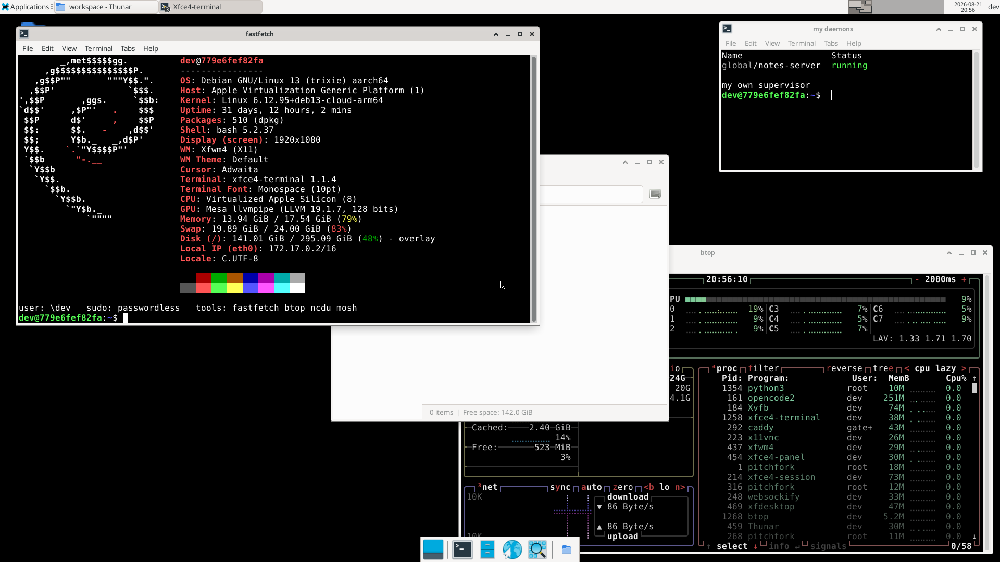

# agent-env

[](https://github.com/dtinth/agent-env/actions/workflows/docker.yml)

A ready-to-use Docker image that turns OpenCode v2 into a hosted, Google-authenticated
workstation.



One container gives you:

| What | Where | Notes |
|---|---|---|
| **OpenCode v2 web UI + API** | `<PUBLIC_URL>/` | `opencode2 serve` |
| **OpenCode v2 TUI** in the browser | `<PUBLIC_URL>/terminal` | the real TUI, over ttyd |
| **XFCE desktop** in the browser | `<PUBLIC_URL>/desktop` | noVNC over x11vnc |
| **agent-browser dashboard** | `<DASHBOARD_PUBLIC_URL>` | own port; live browser viewports |
| **pitchfork dashboard** | `<PUBLIC_URL>/pitchfork` | start/stop/logs for your own daemons |
| **file manager** | `<PUBLIC_URL>/files` | browse, upload, download the workspace |
| **SSH + mosh** | port `22`, UDP `60000-60010` | key-based by default |
| **Google sign-in** in front of all of it | `<PUBLIC_URL>/oauth2/*` | oauth2-proxy behind Caddy |
| **mise** | `/opt/mise` | manages node and anything else you add |
| **a usable shell** | — | git, ripgrep, fd, jq, fastfetch, btop, ncdu, a compiler |
| **pitchfork** | PID 1, plus one per user | supervises it all; the OpenCode server is yours, not root's |
| **agent-browser + Chromium** | on the virtual display | headed, so you can watch it over noVNC |

Everything is configured with environment variables. Nothing needs to be baked
into a custom image.

---

## Quick start

Published images are on GHCR, built for `linux/amd64` and `linux/arm64`:

```bash
docker pull ghcr.io/dtinth/agent-env:latest
```

[`compose.example.yaml`](compose.example.yaml) is a deployment example built on
that image — it declares its ports with `expose` for an ingress controller to
route, and documents the direct-publish and tailscale-serve variants.

### Locally, with basic auth (no Google setup needed)

```bash
docker build -t agent-env .          # or use ghcr.io/dtinth/agent-env:latest

docker run -d --name agent-env --shm-size=2g \
  -p 8080:8080 -p 8081:8081 -p 2222:22 \
  -e AUTH_MODE=basic \
  -e GATEWAY_PASSWORD=changeme \
  -e PUBLIC_URL=http://localhost:8080 \
  -e SSH_AUTHORIZED_KEYS="$(cat ~/.ssh/id_ed25519.pub)" \
  -e ANTHROPIC_API_KEY=sk-ant-... \
  -v agent-env-workspace:/workspace \
  agent-env
```

Open <http://localhost:8080> and sign in as `opencode` / `changeme`.
Then <http://localhost:8080/terminal> for the TUI, and
<http://localhost:8080/desktop> for the desktop.

### For real, with Google sign-in

1. In [Google Cloud Console → Credentials](https://console.cloud.google.com/apis/credentials),
   create an **OAuth 2.0 Client ID** of type *Web application*.
2. Set its **Authorised redirect URI** to exactly `<PUBLIC_URL>/oauth2/callback`,
   e.g. `https://oc.example.com/oauth2/callback`.
3. Copy `.env.example` to `.env`, fill in the client ID/secret, `PUBLIC_URL`,
   and who is allowed in.
4. `docker compose up -d`

```bash
cp .env.example .env
$EDITOR .env
docker compose up -d
docker compose logs -f
```

`PUBLIC_URL` must be the URL users actually type, and it must match the
registered redirect URI. Terminate TLS in front of the container (a load
balancer, Cloudflare, Caddy/nginx on the host) and point it at port 8080.

---

## Authentication

`AUTH_MODE` picks the gate on the way in:

- **`google`** (default) — oauth2-proxy handles the sign-in; Caddy checks every
  request against it with `forward_auth`. Requires `GOOGLE_CLIENT_ID`,
  `GOOGLE_CLIENT_SECRET`, and at least one of `ALLOWED_EMAILS` /
  `ALLOWED_EMAIL_DOMAINS`. The container **refuses to start** without an allow
  list, because otherwise any Google account on the internet could sign in.
- **`basic`** — HTTP basic auth (`GATEWAY_USER` / `GATEWAY_PASSWORD`). Good for
  local runs. A password is generated and printed to the log if you omit it.
- **`none`** — no gate at all. Only sane behind your own authenticating proxy.

Optionally restrict further by Google Workspace group with `GOOGLE_GROUPS`
(needs `GOOGLE_ADMIN_EMAIL` and a delegated service-account key).

`ALLOWED_EMAIL_DOMAINS=*` is accepted and means what it says: anyone with a
Google account. It is deliberately allowed rather than blocked — the check
exists to stop you *forgetting* an allow list, not to overrule one you wrote on
purpose.

`/healthz` is always reachable without auth, so load balancers can probe it.

### How the OpenCode server itself is protected

`opencode2 serve` has its own HTTP basic auth (user `opencode`, password from
`OPENCODE_SERVER_PASSWORD`). The gateway injects that credential on the way
through, so users authenticate once with Google and never see it. If you don't
set `OPENCODE_SERVER_PASSWORD`, one is generated and persisted in the
`opencode-config` volume. The same value is exported inside the container so the
`opencode2` CLI and TUI can talk to the server.

Only ports **8080**, **8081** and **22** listen on external interfaces.
The OpenCode server, VNC, websockify, ttyd, the dashboard and oauth2-proxy are
all bound to loopback.

### SSH host keys

The image ships **no** host keys — Debian's `openssh-server` generates them at
package-install time, so leaving them in would give every deployment, and
anyone who pulled the image, the same private key. The entrypoint generates a
set on first start instead, under `/var/lib/agent-env/ssh`.

**Mount a volume there.** Otherwise the keys live in the container's writable
layer: fine across `restart`, gone the moment you recreate the container to pick
up a new image, and every client then greets you with a changed-host-key
warning. The entrypoint says so loudly if that directory is not a mount.

```yaml
volumes:
  - agent-env-state:/var/lib/agent-env
```

With that volume the fingerprint survives both a restart and an image update;
`agent-env` logs which it did (`generated`/`reusing`) and prints the
fingerprint at every boot.

### Who runs as what

pitchfork is PID 1 and therefore root — it has to be, to reap zombies, run sshd
and drop privileges for everything else. It drops them aggressively:

| Runs as | Processes |
|---|---|
| `root` | pitchfork (PID 1), sshd, the log forwarder, and the wrapper that starts the system D-Bus (`dbus-daemon` itself drops to `messagebus`) |
| `gateway` (system account, no shell, **no sudo**) | Caddy and oauth2-proxy |
| `dev` (uid 1000, passwordless sudo) | everything you actually work in — the OpenCode server, Xvfb, the whole XFCE desktop, x11vnc, websockify, ttyd, agent-browser and Chromium, plus your own pitchfork supervisor |

So **the desktop and everything in it runs as `dev`**, never root — open a
terminal on the noVNC desktop and you are `dev`, same as over SSH.

The two network-facing proxies get their own throwaway account precisely
*because* `dev` has passwordless sudo: a hole in the edge shouldn't hand over
root. Caddy carries `cap_net_bind_service`, so it can still bind a low
`GATEWAY_PORT` without being root.

The virtual display is protected by an MIT-MAGIC-COOKIE in
`/home/dev/.Xauthority`. Without it, every local account — including `gateway` —
could attach to the desktop and inject keystrokes into whatever `dev` has open,
which would have made that account's lack of sudo worth very little. `dev` owns
the cookie, so GUI applications started over SSH still land on the display with
nothing to configure.

Credentials for the gateway (`GOOGLE_CLIENT_SECRET`, `GATEWAY_PASSWORD`, the
cookie secret) are unset before the supervisor is started. oauth2-proxy reads
them from root-owned files instead, so they are absent from the environment of
the OpenCode server — the process that runs whatever the agent was asked to run.
Note that a secret passed with `-e` still sits in the container's *config*, where
`docker inspect` and `docker exec` can see it; the `_FILE` form avoids that
entirely.

`dev` has passwordless sudo, so you can install things inside the container
freely — the image prunes apt's package lists, so run `sudo apt-get update`
first:

```bash
sudo apt-get update && sudo apt-get install -y tmux
mise use -g python@3.13     # no sudo needed; mise is owned by dev
```
 That also means anyone who gets past the gateway has root in
the container — which is why the allow list is mandatory and why each person
should get their own container.

---

## Configuration

See [`.env.example`](.env.example) for the annotated list. The essentials:

| Variable | Default | Purpose |
|---|---|---|
| `PUBLIC_URL` | `http://localhost:8080` | External base URL; drives OAuth redirects |
| `AUTH_MODE` | `google` | `google` / `basic` / `none` |
| `GOOGLE_CLIENT_ID` / `GOOGLE_CLIENT_SECRET` | — | Required for `google` |
| `ALLOWED_EMAILS`, `ALLOWED_EMAIL_DOMAINS` | — | Who may sign in |
| `OAUTH2_PROXY_COOKIE_SECRET` | generated | Set it to survive restarts cleanly |
| `OPENCODE_SERVER_PASSWORD` | generated | OpenCode server credential |
| `OPENCODE_WORKDIR` | `/workspace` | Where the server and TUI start |
| `SSH_AUTHORIZED_KEYS` | — | Newline- or `;`-separated public keys |
| `SSH_PASSWORD` | — | Enables password auth (prefer keys) |
| `DESKTOP_ENABLE` | `true` | XFCE + noVNC |
| `DESKTOP_RESOLUTION` | `1920x1080x24` | Virtual display geometry, `WxH` or `WxHxD` |
| `TTYD_ENABLE` | `true` | Browser TUI at `/terminal` |
| `AB_DASHBOARD_ENABLE` | `true` | agent-browser dashboard on its own port |
| `MISE_TOOLS` | — | Extra global tools, e.g. `python@3.13 go@latest` |
| `USER_SUPERVISOR_ENABLE` | `true` | Run the dev user's own pitchfork at boot |
| `USER_WEB_ENABLE`, `USER_WEB_PATH` | `true`, `pitchfork` | pitchfork's web dashboard |
| `DUFS_ENABLE`, `DUFS_PATH`, `DUFS_ROOT` | `true`, `files`, `/workspace` | the file manager |
| `AGENT_ENV_STATE_DIR` | `/var/lib/agent-env` | Where the SSH host keys are kept |
| `X_TCP_ENABLE` | `false` | Let the display accept TCP (still cookie-gated) |
| `TZ`, `PUID`, `PGID` | `UTC`, `1000`, `1000` | Timezone and uid/gid remapping |

Every variable also accepts a `<NAME>_FILE` form pointing at a file, for Docker
or Kubernetes secrets:

```yaml
environment:
  GOOGLE_CLIENT_SECRET_FILE: /run/secrets/google_client_secret
```

### Three ways to give it the OAuth client secret

Pick whichever suits your deployment:

```bash
-e GOOGLE_CLIENT_SECRET=GOCSPX-...              # plain environment variable
-e GOOGLE_CLIENT_SECRET_FILE=/run/secrets/gcs   # read from a file at startup
-e OAUTH2_PROXY_CLIENT_SECRET=GOCSPX-...        # oauth2-proxy's own variable
```

With the first two, the entrypoint hands the value to oauth2-proxy as
`--client-secret-file` so it never shows up in `ps`. The third is a
passthrough: oauth2-proxy reads its own `OAUTH2_PROXY_*` variables directly, and
the entrypoint stays out of the way rather than overriding them with a flag.
`OAUTH2_PROXY_CLIENT_ID` and `OAUTH2_PROXY_COOKIE_SECRET` work the same way, and
any other `OAUTH2_PROXY_*` variable is inherited by the process too.

### Provider credentials for OpenCode

Either pass API keys as environment variables (`ANTHROPIC_API_KEY`,
`OPENAI_API_KEY`, …), or sign in interactively with `/connect` in the TUI — that
is persisted in the `opencode-state` volume and survives restarts.

You can also drop a config in without rebuilding:

```bash
-e OPENCODE_CONFIG_CONTENT='{"model":"anthropic/claude-opus-5"}'
# or mount one at /home/dev/.config/opencode/opencode.json
```

---

## Operating it

```bash
docker exec -it agent-env agent-env status      # state of every service
docker exec -it agent-env agent-env urls        # what this container serves
docker exec -it agent-env agent-env password    # the OpenCode server password
docker exec -it agent-env agent-env logs caddy  # follow one service
docker exec -it agent-env agent-env top         # pitchfork's interactive dashboard
docker exec -it agent-env agent-env config      # the rendered gateway config
docker exec -it agent-env agent-env daemons     # the rendered daemon definitions
docker exec -it agent-env agent-env restart opencode
docker exec -it agent-env agent-env tui         # attach the TUI from a shell
```

### Supervision

[pitchfork](https://pitchfork.jdx.dev) runs as PID 1 in its container mode, so
zombies are reaped and `docker stop` shuts every daemon down in order — a clean
exit takes a few seconds, well inside Docker's grace period.

Daemons declare what they need rather than guessing at timing:

```toml
[daemons.x11vnc]
run = "/opt/agent-env/bin/run-x11vnc"
depends = ["xvfb"]        # start ordering, resolved topologically
ready_port = 5900         # "up" means the port answers
retry = true
```

`agent-env` is the way in for system services: it sets the system supervisor's
directories and sudos into it for you. A bare `pitchfork` resolves to the
*invoking user's* supervisor, which is the point — but it means
`docker exec <container> pitchfork list` looks at the dev user's supervisor and
fails on permissions. Use `agent-env status` there.

pitchfork captures each daemon's output into its own log store, which is what
`agent-env logs` reads. A small `zz-log-forward` daemon also streams everything to
PID 1's stdout, so `docker logs -f agent-env` and your log driver still see the lot,
prefixed with `[global/<daemon>]`.

Run `scripts/smoke-test.sh` against a live container to check the whole thing:

```bash
./scripts/smoke-test.sh http://localhost:8080 opencode:changeme
```

### Your own daemons — including the OpenCode server

The system supervisor is root's and stays that way. You get a **second,
unprivileged pitchfork supervisor of your own** — its own state, socket and
logs — so `pitchfork` as `dev` means *your* daemons and can't touch the
container's.

**The OpenCode server runs there**, not in the root supervisor. It is the thing
you are here to use rather than part of the plumbing, so you can restart it,
read its logs and watch its memory without sudo — from the terminal, or from
pitchfork's web UI at `<PUBLIC_URL>/pitchfork`:

```bash
pitchfork restart opencode      # no sudo
pitchfork logs -f opencode
```

Its definition lives in a managed block at the end of
`~/.config/pitchfork/config.toml`, rewritten on every start so an existing
config volume picks up changes. Anything you put above that block is yours and
is left alone.

Add your own alongside it:

```bash
$ $EDITOR ~/.config/pitchfork/config.toml   # above the managed block
[daemons.api]
run = "npm run dev"
dir = "/workspace/my-app"
ready_port = 3000
boot_start = true      # comes up with the container
retry = true

$ pitchfork start api
$ pitchfork list
global/api       running
global/opencode  running
$ pitchfork logs -f api
$ pitchfork tui                # the same dashboard, in the terminal
```

Set `USER_WEB_ENABLE=false` to drop the web dashboard, or `USER_WEB_PATH` to
serve it somewhere other than `/pitchfork`. It binds loopback only; the gateway
is what exposes it, behind the same authentication as everything else. Note that
it can edit the config and stop daemons — no more privilege than the TUI already
gives, but worth knowing.

Project daemons are usually better off in a `pitchfork.toml` next to your code —
`/workspace/pitchfork.toml` is on a volume, so it survives a rebuild, and
`pitchfork start -l` starts everything in it.

`agent-env status` shows both tables at once. The `agent-env` commands that touch
system services sudo into root for you; `agent-env mine` lists just yours.

Set `USER_SUPERVISOR_ENABLE=false` if you don't want the user supervisor running
at boot — you can still start one on demand.

Because the two supervisors cannot see each other, nothing in the system set
`depends` on the OpenCode server any more. Caddy is a proxy and does not need
its upstream at startup; the browser terminal waits for the server before
starting the TUI; and the container's health check tests the OpenCode port as
well as the gateway, so "healthy" still means the server is actually up.

Two details worth knowing if you go poking at this:

- `/etc/pitchfork/config.toml` is deliberately left empty. pitchfork reads it as
  the system-wide config layer for *every* supervisor, and a root-only file
  there is fatal for an unprivileged one — so the system supervisor keeps its
  config in `/opt/agent-env/pitchfork` instead.
- `/tmp/fslock` is pre-created mode 1777. pitchfork locks there, and whichever
  supervisor started first would otherwise own the directory and shut everyone
  else out.

Over SSH, the toolchain is on `PATH` for interactive *and* non-interactive
sessions:

```bash
ssh -p 2222 dev@host
ssh -p 2222 dev@host 'opencode2 run "summarise this repo"'
```

### mosh

Better than SSH over a flaky connection — it survives roaming and suspend. The
client picks the UDP port, so pass a range the container publishes:

```bash
mosh -p 60000:60010 --ssh="ssh -p 2222" dev@host
```

The image `EXPOSE`s `60000-60010/udp` and compose publishes the same range
(`HOST_MOSH_PORTS` to change it). One port per concurrent session, so widen the
range if you want more than ten. `agent-env urls` prints the exact command.

### Volumes

| Path | Holds |
|---|---|
| `/workspace` | your code |
| `/home/dev` | **everything else you accumulate** — see below |
| `/var/lib/agent-env` | generated SSH host keys |

Three volumes, and you want all three. The home directory is the one that is
easy to under-mount and regret: it holds OpenCode sessions and provider logins,
your own daemon definitions, agent-browser profiles, git config, shell history,
SSH client config, and any tool the agent installs into `~/.local/bin`,
`~/.cargo`, `~/.npm-global` and so on. Without it, everything an agent set up for
itself is gone the moment you recreate the container on a new image. The
entrypoint warns if it or the state directory is not a mount.

A *named* volume is seeded from the image on first use, so the dotfiles the
image ships arrive as normal. A *bind* mount arrives empty, so the entrypoint
copies in anything missing without touching what is already there.

### Toolchains

The mise toolchain lives in `/opt/mise`, deliberately *outside* the home volume:
node, `opencode2` and `agent-browser` are the image's business, so pulling a new
image is what updates them. If they lived in the volume, the first version you
ever ran would be frozen there.

The image's own tools are declared in [`mise/config.toml`](mise/config.toml) and
pinned in [`mise/mise.lock`](mise/mise.lock), which records an exact version and
a **SHA256 checksum per architecture**. The build installs from the lockfile, so
it gets the same node every time and verifies it — rather than resolving whatever
24.x happens to be newest that day. To move it:

```bash
mise lock --global --bump --platform linux-x64,linux-arm64
```

mise reads that file as its *system* config, so it never collides with what you
declare in `~/.config/mise` on the home volume.

The consequence is that tool *installs* do not survive recreation — but the
*declarations* do, because `mise use -g` writes to `~/.config/mise/config.toml`
on the home volume, and the entrypoint reinstalls from it at boot:

```bash
$ mise use -g jq@1.7        # declared in the home volume
$ jq --version              # jq-1.7
# ...recreate the container on a new image...
$ jq --version              # jq-1.7, reinstalled at boot
```

`MISE_TOOLS` does the same thing declaratively from your compose file. Either
way, the first boot after a recreate spends time reinstalling, so heavyweight
toolchains are better put in the image with a `FROM ghcr.io/dtinth/agent-env` of
your own.

#### Shims, and where they stop

Tool resolution works through mise's shims, which is what makes `node` resolve
correctly for a daemon, for `ssh host <command>`, and for anything the agent
shells out to — none of which ever display a prompt. Shims cannot do everything
`mise activate` does, so **interactive** bash additionally gets the full
activation: a project's `mise.toml` `[env]` and the `cd` hooks work when you are
actually sitting in a repo. Two things follow from using shims:

- `which node` reports the shim, not the tool. `mise which node` gives the real
  path.
- If a declared tool is not installed, a shim falls back to the next
  same-named executable on `PATH` rather than failing — so a missing `python`
  can silently become the system one. Auto-install is on, which normally
  prevents that, and the entrypoint pre-installs from your declarations at boot.

#### Untrusted repositories

A `mise.toml` in a repository can set environment variables and define tasks, so
mise does not load one until you trust it:

```
mise WARN /workspace/some-repo/mise.toml is not trusted, run `mise trust` to enable it
```

That is the right default here, where an agent clones code it has never seen —
and it is asserted by the smoke suite. `mise trust` accepts a config once you
have looked at it. Two further knobs if you want more distance from repository
content: `MISE_SAFE=1` blocks template functions, hooks and scripts while still
resolving versions, and the `paranoid` setting requires re-trusting a config
whenever its contents change. Neither is on by default, because an agent that
runs a repository's build is already running its code.

Mounting host directories at `/workspace` or `/home/dev`? Set `PUID`/`PGID` to
match their owner.

### The desktop

Geometry comes from the environment, either as one value or as parts:

```bash
-e DESKTOP_RESOLUTION=2560x1440x24   # WxH or WxHxD (depth 8/15/16/24/30)
-e DESKTOP_RESOLUTION=1600x900       # depth defaults to 24
# or, equivalently
-e DESKTOP_WIDTH=1600 -e DESKTOP_HEIGHT=900 -e DESKTOP_DEPTH=24
```

An unparseable value fails at startup with a message naming the expected form,
rather than leaving you with a dead display.

**Several people can watch and use the same desktop at once.** x11vnc runs with
`-shared -forever`, and websockify forks a process per browser, so viewers join
the session rather than kicking each other off. `scripts/smoke-test.sh` asserts
this by opening four concurrent RFB connections.

Resolution is fixed for the life of the display: Xvfb has no dynamic RandR
resizing, so noVNC's client-side scaling is what adapts to your window. Change
`DESKTOP_RESOLUTION` and `agent-env restart xvfb` (then `desktop`, `x11vnc`) for a
different geometry. Set `VNC_PASSWORD` for a second factor in front of the
desktop specifically, and `VNC_VIEW_ONLY=true` for a read-only session.

### Files

[dufs](https://github.com/sigoden/dufs) serves the workspace at
`<PUBLIC_URL>/files` — browse it, drag files in, download a folder as an
archive, search, rename, delete. Useful when the thing you need to move is not
worth an `scp` invocation, and when you are working from a tablet or a machine
without your keys.

It is a daemon of *your* supervisor, not the system's: it runs as `dev`, writes
files as `dev`, shows up in `/pitchfork` beside the OpenCode server, and
`pitchfork restart dufs` needs no sudo. It binds loopback, so the gateway's
authentication is what stands in front of it.

Upload, delete, search and archive are on. `--allow-symlink` is deliberately
off, so a symlink inside the workspace cannot be used to browse the rest of the
filesystem — the smoke suite checks that. Add it back, or anything else dufs
takes, with `DUFS_ARGS`:

```bash
DUFS_ENABLE=false        # turn it off
DUFS_ROOT=/srv/shared    # serve something other than /workspace
DUFS_PATH=files          # the path it lives under
DUFS_ARGS=--allow-symlink
```

dufs is installed by mise from `mise/config.toml`, so it is pinned and
checksum-verified in the lockfile like everything else.

### Running a GUI app from your own machine

The desktop is a real X display, and you can point an application on another
machine at it. Forward the display socket over SSH and copy its cookie across:

```bash
# 1. forward the container's X socket to a spare local display number
ssh -p 2222 -N -L /tmp/.X11-unix/X99:/tmp/.X11-unix/X1 dev@host &

# 2. copy the cookie over, registered against that local number
cookie=$(ssh -p 2222 dev@host 'agent-env x-cookie' | awk '{print $3}')
xauth add :99 MIT-MAGIC-COOKIE-1 "$cookie"

# 3. run something
DISPLAY=:99 xeyes
```

It then appears on `/desktop` alongside everything else. Plain X clients work as
they are; GTK applications generally want a session bus, so run them under
`dbus-run-session` or just start them inside the container.

`agent-env x-cookie` is there so you do not have to go digging for the cookie.
If you would rather forward a TCP port than a socket, set `X_TCP_ENABLE=true`
and the display listens on `600<N>` — still cookie-protected, but do not publish
that port.

### agent-browser

Chromium is installed from Debian and wired up already, as **user-level
defaults** in `~/.agent-browser/config.json`:

```json
{
  "headed": true,
  "executablePath": "/usr/bin/chromium",
  "args": "--no-sandbox,--disable-dev-shm-usage,--disable-gpu"
}
```

So `agent-browser open example.com` is headed with no flags. It lives in the
config file rather than in `AGENT_BROWSER_*` environment variables on purpose —
agent-browser's precedence is

```
~/.agent-browser/config.json  <  ./agent-browser.json  <  AGENT_BROWSER_*  <  CLI flags
```

so env vars would sit *above* a project's own `agent-browser.json` and quietly
override it. As a config file it is a real default: override it per project, per
command, or for the whole container:

```bash
agent-browser --headed false snapshot          # one command
echo '{"headed": false}' > ./agent-browser.json # one project
docker run -e AGENT_BROWSER_HEADED=false ...    # whole container
```

Because it runs headed on display `:1`, you can open `/desktop` and *watch* the
browser work. The dashboard on port 8081 shows live viewports and the command
feed.

`--no-sandbox` is the default because Chromium's sandbox needs privileges most
container runtimes deny. If your runtime allows it, drop that flag and add a
Chromium seccomp profile instead.

Chromium needs a large `/dev/shm`: keep `--shm-size=2g` (compose already sets it).

---

## Notes and limits

- **OpenCode v2 is beta.** It installs as `opencode2` from
  `@opencode-ai/cli@beta`; the image pins the tag, not a version. Set the
  `OPENCODE_VERSION` build arg to pin an exact one, and `OPENCODE_DISABLE_AUTOUPDATE=1`
  is already set so the container never self-updates under you.
- **The dashboard needs its own port.** It's a Next.js app that serves assets
  from absolute paths, so it can't live under a path prefix like `/desktop` does.
  It gets port 8081 with the same authentication. Set `DASHBOARD_PUBLIC_URL` if
  your host port differs from the container's, or `AB_DASHBOARD_ENABLE=false` to
  turn it off.
- **Image size is ~3 GB.** Most of it is XFCE, Chromium, a compiler toolchain and
  the ~150 MB OpenCode binary. Drop `DESKTOP_ENABLE`-related packages from the
  Dockerfile if you don't need the desktop.
- **pitchfork's container mode is marked experimental** by its own docs. It has
  behaved correctly here — PID 1, reaping, ordered graceful shutdown — but that
  is the one component whose stability is self-declared as not guaranteed. The
  daemon definitions are plain TOML rendered by the entrypoint, so swapping in
  another supervisor is a contained change if you ever need to.
- **Single-tenant.** You work as `dev`, which has passwordless sudo — so anyone
  past the gate effectively has root in the container. Give each person their
  own container rather than sharing one.
- **Multi-arch.** Builds for `linux/amd64` and `linux/arm64`; all fetched
  binaries resolve per `TARGETARCH`.

### Building for both architectures

```bash
docker buildx build --platform linux/amd64,linux/arm64 -t your-registry/agent-env:latest --push .
```

CI does this on native runners rather than under QEMU — `.github/workflows/docker.yml`
builds each architecture on its own runner (`ubuntu-latest` and `ubuntu-24.04-arm`),
pushes it to GHCR *by digest and untagged*, runs `scripts/smoke-test.sh` against
the pushed artifact, and only merges the digests into a tagged manifest list once
both pass. A failed test therefore can't leave a broken `:latest` behind. Pull
requests build and test without pushing, and a weekly run picks up new OpenCode
v2 beta builds.

---

## How it fits together

```
                    ┌─── container (pitchfork = PID 1) ──────────────┐
   browser ──8080──►│ Caddy ──forward_auth──► oauth2-proxy ──► Google│
                    │   │                                            │
                    │   ├─ /            ──► opencode2 serve  :4096   │
                    │   ├─ /pitchfork   ──► pitchfork web    :4747   │
                    │   ├─ /files       ──► dufs             :5000   │
                    │   ├─ /terminal    ──► ttyd :7681 ──► TUI       │
                    │   ├─ /desktop     ──► websockify :6080         │
                    │   │                     └─ x11vnc :5900 ──► Xvfb :1 ──► XFCE
                    │   └─ /healthz                                  │
                    │                                                │
   browser ──8081──►│ Caddy (same auth) ──► agent-browser dash :4848 │
   ssh    ────22───►│ sshd ──► dev                                   │
                    └────────────────────────────────────────────────┘
```

`Xvfb :1` also backs headed Chromium, which is why agent-browser sessions show
up on the noVNC desktop.

## Layout

```
Dockerfile                          image definition
docker-compose.yml                  ports, volumes, health check
.env.example                        every setting, annotated
rootfs/usr/local/bin/entrypoint.sh  validates config, renders the Caddyfile and
                                    the pitchfork daemons, then exec's PID 1
rootfs/usr/local/bin/agent-env         operator helper
rootfs/opt/agent-env/bin/run-*         one launcher per service, including the
                                    dev user's own nested supervisor
scripts/smoke-test.sh               end-to-end check of a running container
```

Services are enabled or omitted by the entrypoint when it renders
`/etc/pitchfork/config.toml`, so disabling one means it never starts rather than
starting and idling.
